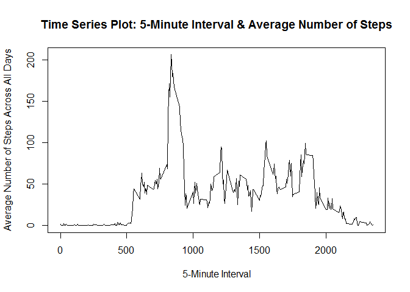

# Reproducible Research: Peer Assessment 1

## Loading and preprocessing the data

Load the libraries needed in the report.


```r
library(knitr)
library(dplyr)
```

```
## 
## Attaching package: 'dplyr'
```

```
## The following objects are masked from 'package:stats':
## 
##     filter, lag
```

```
## The following objects are masked from 'package:base':
## 
##     intersect, setdiff, setequal, union
```

```r
library(lattice)
```

Load the activity data into R using read.csv(). Convert the "date" column from a factor to a date.


```r
act <- read.csv("activity.csv", header = TRUE, sep = ",")
act$date <- as.Date(act$date, format = "%Y-%m-%d")
```

## What is mean total number of steps taken per day?

*Create a histogram to display the total number of steps taken per day.*

The histogram below displays the total number of steps taken per day. Breaks for the bars in the histogram are set every 1000 steps. 

Per instructions, missing values are ignored for this part of the assignment. Missing values are isolated to eight days. All values are missing for each of the eight days that include missing values, so using tapply in the histogram function below will work for this dataset.


```r
##Create a histogram to display the total number of steps taken per day
##ylim is set between 0 and 15 to be consistent with histogram that appears later in report
hist(with(act, tapply(steps, date, sum)),
     col = "blue",
     ylim = c(0,15),
     main = "Histogram of Total Number of Steps per Day",
     xlab = "Total Number of Steps per Day",
     breaks = c(0, seq(1000, 25000, 1000)))
```

<!-- -->

*Calculate and report the mean and median total number of steps taken per day.*


```r
##Calculate the mean and median total number of steps taken per day
##Per instructions, missing values are ignored for this part of the assignment
dailytotal <- with(act, tapply(steps, date, sum))
mn <- format(mean(dailytotal, na.rm=TRUE),scientific = FALSE)
md <- format(median(dailytotal, na.rm=TRUE),scientific = FALSE)
```

The mean total number of steps taken per day is 10766.19.

The median total number of steps taken per day is 10765.

## What is the average daily activity pattern?

*Create a time series plot of the 5-minute interval (x-axis) and the average number of steps taken, averaged across all days (y-axis).*

Prior to plotting, a summary of the average number of steps for each 5-minute interval across all days was created.


```r
##Calculate average number of steps for each 5-minute interval across all days
avg <- select(act, interval, steps) %>%
       group_by(interval) %>%
       summarize(steps = mean(steps, na.rm=TRUE))

##Update column names
colnames(avg) <- c("interval", "avg_steps")

##Create time series plot of 5-minute interval and average number of steps taken, averaged across all days
plot(avg$interval, avg$avg_steps, type = "l", 
     main = "Time Series Plot: 5-Minute Interval & Average Number of Steps",
     xlab = "5-Minute Interval",
     ylab = "Average Number of Steps Across All Days")
```

<!-- -->

*Find which 5-minute interval, on average across all days in the dataset, contains the maximum number of steps.*


```r
##Calculate 5-minute interval with maximum number of steps, on average
maxinterval <- c(avg[avg$avg_steps == max(avg$avg_steps),1])
```

On average, across all days in the dataset the 835-minute interval contains the maximum number of steps.

## Imputing missing values

Several days in the dataset include missing steps values. Missing values are coded as "NA" in the dataset.

*Calculate and report the total number of missing values in the dataset.*


```r
##Calculate the total number of missing values in the dataset
missingvalues <- sum(is.na(act$steps))
```

The total number of missing values in the dataset is 2304.

*Devise a strategy for filling in all the missing values in the dataset.*

To fill in all missing values in the dataset, this analysis will take the approach of replacing NA values with the mean for the 5-minute interval to which the NA value is assigned. The mean of each 5-minute interval will be calculated across all days in the dataset. The code for filling in all missing values and creating a new dataset with missing data filled in is found in the next subsection.

*Create a new dataset that is equal to the original dataset but with the missing data filled in.*

```r
##create new data frame that merges "act" & "avg" data frames created in previous code blocks
##new df includes both original # of steps and average # of steps for each 5-minute interval
new <- merge(act,avg) %>%
       arrange(date, interval)

##use for loop to replace NA values in "steps" with daily interval averages
##after merge/arrange, in "new" df column 1 = interval, col 2 = steps, col 3 = date, col 4 = avg_steps
for(i in 1:nrow(new)){
    if(!is.na(new[i,2])) {
        new[i,2] = new[i,2]
        }
      else {
        new[i,2] = new[i,4]
        }
}

##create "impute_values" data frame and remove "avg_steps" column from data frame
impute_values <- new[,1:3]
```

*Make a histogram of the total number of steps taken each day and calculate and report the mean and median total number of steps taken per day. Do these values differ from the estimates from the first part of the assignment? What is the impact of imputing missing data on the estimates of the total daily number of steps?*

The histogram below displays the total number of steps taken per day. NA values have been replaced with the mean for the 5-minute interval to which the NA value is assigned. Breaks for the bars in the histogram are set every 1000 steps.


```r
hist(with(impute_values, tapply(steps, date, sum)),
     col = "green",
     main = "Histogram of Total Number of Steps per Day with Imputed Values",
     xlab = "Total Number of Steps per Day with Imputed Values",
     breaks = c(0, seq(1000, 25000, 1000)))
```

<!-- -->


```r
##Calculate daily totals, mean, and median with imputed values inserted in place of missing values
imputed_dailytotal <- with(impute_values, tapply(steps, date, sum))
imputed_mn <- format(mean(imputed_dailytotal),scientific = FALSE)
imputed_md <- format(median(imputed_dailytotal),scientific = FALSE)
```

The mean total number of steps taken per day with imputed values included is 10766.19. The mean value calculated with imputed values is the same as the mean value calculated when ignoring NA values.

The median total number of steps taken per day with imputed values included is 10766.19. The median value caclulated with imputed values increased very slightly in comparison to the median value calculated when ignorning NA values.

With the methodology used for imputing missing data, the mean total number of steps taken per day did not change, while the median total number of steps taken per day increased very slightly. Overall, there were 2304 missing values over 8 full days. When comparing the histograms of the total number of steps taken each day, the distributions are very similar. The only change in the histogram occurs in the bar measuring the frequency of steps in the 10,000-11,000 bar. Eight days included missing values, and all values in these eight days were missing, or NA. Therefore, with the methodology used, all eight days with missing values had the same estimated total number of days (between 10,000 and 11,000 steps).

## Are there differences in activity patterns between weekdays and weekends?

*Create a new factor variable in the dataset with two levels -- "weekday" and "weekend" indicating whether a given date is a weekday or weekend day.*


```r
##add column to impute_values with the weekday
impute_values <- mutate(impute_values, day = weekdays(date))

##convert day column to either "weekend" or "weekday" category based on day entry
for(i in 1:nrow(impute_values)){
    if(impute_values[i,4] %in% c("Saturday","Sunday")) {
        impute_values[i,4] = "weekend"
        } 
      else {
          impute_values[i,4] = "weekday"
          }
}

##convert day column to factor
impute_values$day <- factor(impute_values$day)
```

*Make a panel plot containing a time series plot (i.e. type = "l") of the 5-minute interval (x-axis) and the average number of steps taken, averaged across all weekday days or weekend days (y-axis).*

The panel plot below displays the average number of steps taken per 5-minute interval averaged across all weekend days (top pane) or weekday days (bottom panel). 


```r
##calculate average number of steps per 5-minute interval averaged accross all days by day type and interval
impute_avg <- select(impute_values, day, interval, steps) %>%
              group_by(day, interval) %>%
              summarize(steps = mean(steps))

##create panel time-series plot for weekend vs. weekday
xyplot(steps ~ interval|day, data = impute_avg, type = "l", layout = c(1,2),
       xlab = "Interval",
       ylab = "Number of Steps",
       main = "Average # of Steps per 5-Minute Interval, Weekend vs. Weekday")
```

<!-- -->

